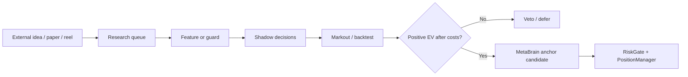

# Strategy Integration Plan - 2026-05-21

## Goal

Integrate the useful parts of the strategy material reviewed today without
turning social-media claims into live trading rules.  Every new idea enters the
system as one of three things:

1. A measurable feature used by existing signal providers.
2. A guard that blocks false-positive opportunities.
3. A research queue item that must pass shadow/backtest evidence first.

Live trading remains frozen until QA and explicit operator approval.

## What We Integrated Now

### 1. VWAP + Market Regime Features

Source ideas:

- VWAP day-trading papers.
- Mean-reversion/regime-switching papers.
- Equity/options fair-value reels.

Implementation:

- `agents/application/market_microstructure.py`
- `agents/application/openbb_market_data.py`

The feature extractor calculates:

- volume-weighted average price (`micro_vwap`),
- distance from VWAP (`micro_vwap_deviation_pct`),
- mean-reversion z-score (`micro_mean_reversion_zscore`),
- return autocorrelation,
- realized volatility,
- regime: `trending`, `mean_reverting`, `stretched`, `mixed`, or `unknown`.

Policy:

- These features can adjust confidence slightly.
- They do not place orders.
- They do not override MetaBrain, positive EV, risk gate, or position manager.
- A stretched mean-reverting regime dampens late momentum entries.
- A trending regime can give a small confidence boost only when direction and
  VWAP deviation agree.

### 2. Cross-Venue Arbitrage Quality Guard

Source ideas:

- Oddpool-style Polymarket/Kalshi scanners.
- Cross-venue mispricing in prediction markets.

Implementation:

- `agents/application/arb_quality.py`

The guard checks:

- YES + NO cost across venues,
- rule compatibility,
- quote freshness,
- depth,
- net profit after round-trip cost buffer.

Policy:

- Arbitrage can be an anchor only after this guard returns `arb_candidate`.
- Rule mismatch blocks even if prices look profitable.
- Thin depth blocks.
- Net profit below minimum blocks.

### 3. Strategy Research Queue

Source ideas:

- SSRN/research-paper workflow.
- OpenBB/QuantDinger/TensorTrade/social strategy discovery.
- Latent-regime/chaos claims.

Implementation:

- `config/research_queue.json`
- `scripts/research_queue.py`

Queue status today:

- `vwap_microstructure_signal` - implemented as shadow features.
- `mean_reversion_regime_filter` - implemented as shadow features.
- `oddpool_style_cross_venue_arb` - implemented as guard.
- `ssrn_research_ingestion` - queued.
- `latent_regime_chaos_score` - deferred until reproducible.

## Why This Is The Right Shape

The system already has enough “agents”.  The missing piece was not another
unbounded trader; it was a disciplined path from idea to evidence:



## Operational Rules

- No new live entry is allowed directly from research code.
- All new sources must expose measurable features or explicit blockers.
- Every signal must be logged so later markout/backtest can judge it.
- Arbitrage needs rule mapping, fresh quotes, depth, and fees.
- VWAP/regime features are advisory until they show positive shadow markouts.

## Next QA Before Live

Run locally and on the server:

```bash
python -m unittest tests.test_market_microstructure tests.test_arb_quality tests.test_research_queue tests.test_openbb_market_data tests.test_decision_governance
python scripts/research_queue.py --json
python scripts/validate_agent_registry.py --json
```

Then run the full suite before any live trading window.
